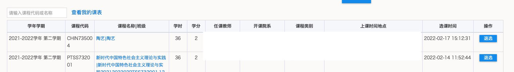
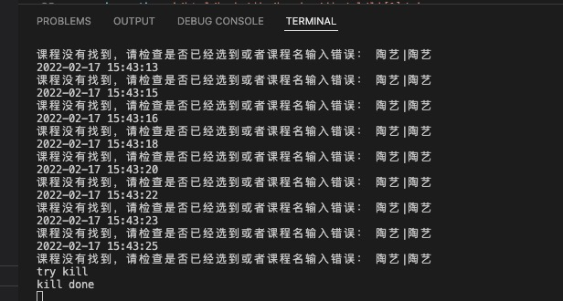

# qiangke_fdu

## 一、简介
        此代码适用于复旦大学研究生选课系统开放选课之后刷已满的课捡漏，例如热门的公选课。

        基本原理是利用 selenium 库去搜索页面上的按钮，输入框，表格等元素来模拟人的选课操作，所以速度受网页加载速度影响，不会对服务器造成太大压力。

        理论上来说稍加改动，可以适用于任何学校的选课系统。

        验证码识别使用了 ddddocr 库。
成果展示：

## 二、安装
### 2.1 安装浏览器 driver
        理论上支持很多浏览器，只要安装对应的 driver 就行，注意浏览器的版本要和 driver 的版本对应。但本人在使用时 chromedriver 比 chrome 低了一个版本，也可以正常使用。
        作者使用 m1pro mac 加 chrome 浏览器。
        Windows 系统以及其他浏览器请自行搜索关键词“搭建 Selenium 运行环境”。
        基本流程就是把 driver 文件所在的目录添加到系统变量中，并给文件运行权限。
        可参考 https://zhuanlan.zhihu.com/p/112406390

### 2.2 Python 环境
    需要 Python 运行环境。
    需要的包：
    · selenium
    · onnxruntime
    · ddddocr
        要注意的是 onnxruntime 在 M1 mac 上直接 pip 安装好像不行，作者使用了 `pip3 install -i https://test.pypi.org/simple/ onnxruntime`

        ddddocr 在 pip 安装之后好像不能正常 import，所以作者直接把库复制了过来。

